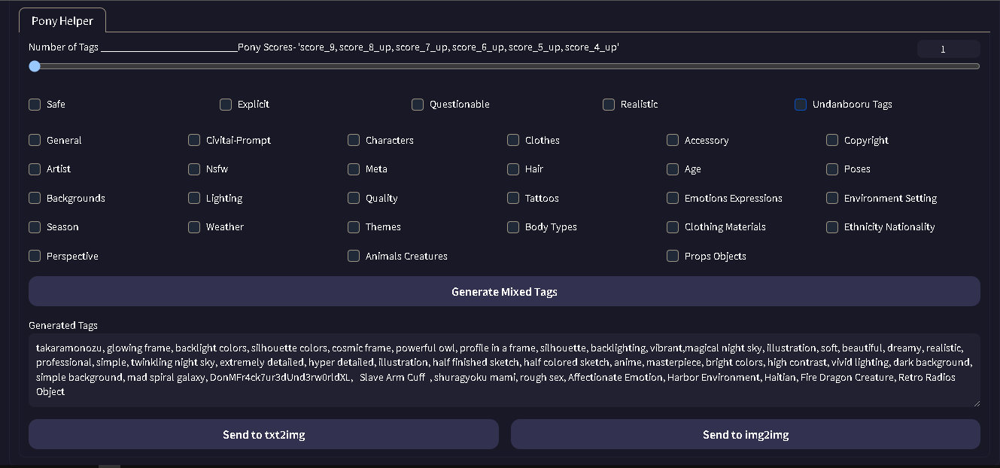

# Prompt generator
An extension for [webui](https://github.com/AUTOMATIC1111/stable-diffusion-webui) or Forge [webui](https://github.com/lllyasviel/stable-diffusion-webui-forge) that Help you Build prompts.

0. ✅Adding more tags 100%done
1. ✅Adding characters only suggestion's
2. ✅seperating Tags SFW/NSFW in a special toggle/button 99% done
4. ✅Fully offline
5. ✅Adding seperate categories 99% done
6. ✅sending to webui TXT2Image or image2image 100%

#

the standalone version with its own webui-based https://github.com/dan4in/Stable-diffusion-Prompt-Helper-Pony/tree/main
